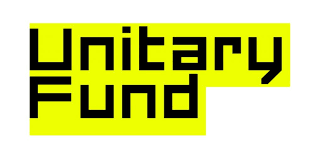

# KnowYourLimits

 
Depository for KnowYourLimit Project, which allows for the assessment of noisy, limited connectivity quantum devices for optimization.

The techniques and algorithms implemented in this package are mostly based on the results of the paper [Limitations of Optimization on Noisy quantum devices](https://doi.org/10.1038/s41567-021-01356-3). Watch [this video](https://www.youtube.com/watch?v=kmTgfzj69B0&t=2473s) for a technical overview of the algorithm.

See the documentation at [https://dsfranca.github.io/KnowYourLimit/](https://dsfranca.github.io/KnowYourLimit/) for more details on the project, how to install it and how to use it.

The documentation also includes multiple examples!

## Contributing 

Feel free to contribute by adding Github issues and pull requests. Adding test cases for any contributions is a requirement for any pull request to be merged.

## Future plans

The current version of KnowYourLimits only supports assessing the potential of noisy quantum devices to solve classical problems. 
It also does not allow for estimating the effects of error mitigation on its predictions. 
These should also be addressed in future versions, please let me know if you wish to collaborate on those!

 

 